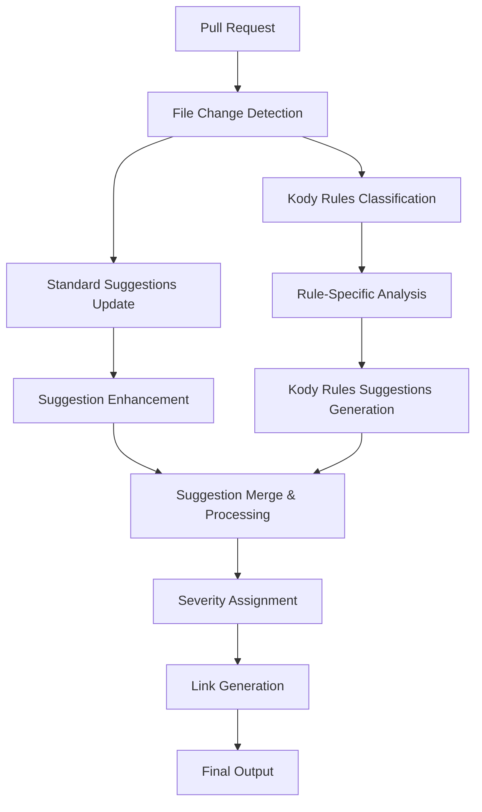

# Kody Rules System - Complete Flow Documentation

## Overview

The Kody Rules system is a sophisticated code analysis engine that combines standard code review suggestions with organization-specific coding rules. This document explains how the entire system works, from initial analysis to final suggestion delivery, including the recent updates for enhanced suggestion processing.

## System Architecture

### 1. Core Components

#### A. Analysis Pipeline


#### B. LLM Chain Architecture
The system uses multiple specialized LLM chains working in parallel:
- **Classifier Chain**: Identifies which Kody Rules apply to the code changes
- **Update Chain**: Enhances standard suggestions with Kody Rules context
- **Generation Chain**: Creates new Kody Rules-specific suggestions
- **Guardian Chain**: Validates and filters final suggestions

### 2. Kody Rules Processing Flow

#### Step 1: Initial Setup
```typescript
// Prepare analysis context with applicable Kody Rules
const kodyRulesFiltered = getKodyRulesForFile(
    fileContext.file.filename,
    context?.codeReviewConfig?.kodyRules || []
);

const baseContext = {
    pullRequest: context?.pullRequest,
    patchWithLinesStr: fileContext?.patchWithLinesStr,
    kodyRules: kodyRulesFiltered,
    // ... other context data
};
```

#### Step 2: Parallel Processing
The system runs multiple analysis chains simultaneously for efficiency:

```typescript
const [classifiedRulesResult, updateStandardSuggestionsResult] = 
    await Promise.all([
        classifiedKodyRulesChain.invoke(baseContext),
        hasCodeSuggestions 
            ? updateStandardSuggestionsChain?.invoke(extendedContext)
            : Promise.resolve(undefined),
    ]);
```

#### Step 3: Rule Classification
Determines which Kody Rules are relevant to the current changes:
- **Input**: All applicable Kody Rules + code changes
- **Output**: Filtered list of relevant rules with reasoning
- **Purpose**: Optimize processing by focusing on relevant rules only

#### Step 4: Standard Suggestions Update ⚡ NEW FEATURE
Enhances existing standard suggestions with Kody Rules awareness:

##### A. Processing Logic
```typescript
interface KodyRulesUpdateResponse {
    overallSummary: string;
    codeSuggestions: Array<{
        // ... standard fields
        violatedKodyRulesIds?: string[];  // Silent fixes
        brokenKodyRulesIds?: string[];    // Promote to Kody Rules
    }>;
}
```

##### B. Three Processing Paths

**Path 1: Violated Rules (Silent Fixes)**
```typescript
if (hasViolated) {
    processedSuggestions.push({
        ...normalizedSuggestion,
        label: suggestion.label,  // Keep original label
        // Only improvedCode is updated silently
    });
}
```

**Path 2: Broken Rules (Promote to Kody Rules)**
```typescript
if (hasBroken) {
    processedSuggestions.push({
        ...normalizedSuggestion,
        label: 'kody_rules',  // Fixed label
        brokenKodyRulesIds: suggestion.brokenKodyRulesIds,
    });
}
```

**Path 3: Standard Enhancement**
```typescript
else {
    processedSuggestions.push(normalizedSuggestion);
    // LLM improvements applied without special classification
}
```

#### Step 5: Kody Rules Suggestions Generation
Creates new suggestions specifically for detected rule violations:
- **Input**: Classified rules + enhanced context
- **Output**: Rule-specific suggestions with proper formatting
- **Features**: Auto-links to rule documentation, severity assignment

#### Step 6: Result Merging
Combines all suggestion types into a unified output:

```typescript
let finalOutput = {
    codeSuggestions: [
        ...generatedKodyRulesSuggestions?.codeSuggestions,  // New Kody Rules
        ...updatedSuggestions?.codeSuggestions,             // Enhanced suggestions
    ],
    overallSummary: // Combined summary
};
```

## Key Features

### 1. Intelligent Suggestion Enhancement ⚡ NEW

#### Problem Solved
Previously, standard suggestions could inadvertently violate Kody Rules or miss opportunities to become rule-specific suggestions.

#### Solution
The UPDATE chain now processes standard suggestions with three outcomes:

1. **Silent Fixes**: Minor violations are corrected transparently
2. **Promotion**: Important violations become Kody Rules suggestions
3. **Enhancement**: General improvements without classification changes

### 2. Rule-Aware Link Generation

#### Automatic Link Creation
```typescript
// Transforms rule IDs into clickable links
const markdownLink = `[${escapeMarkdownSyntax(rule.title)}](${ruleLink})`;
```

#### Smart ID Detection
- UUID pattern matching in suggestion content
- Fallback LLM extraction for complex cases
- Support for various code formatting (backticks, code blocks)

### 3. Dynamic Severity Assignment

#### Rule-Based Severity
```typescript
const severities = suggestion.brokenKodyRulesIds
    .map(ruleId => {
        const rule = kodyRules.find(kr => kr.uuid === ruleId);
        return rule?.severity;
    })
    .filter(Boolean);
```

#### Hierarchical Fallback
- Primary: Rule-defined severity
- Secondary: Suggestion-level severity
- Tertiary: Default system severity

### 4. Type Safety & Error Handling

#### Strong Typing
```typescript
interface KodyRulesUpdateResponse {
    overallSummary?: string;
    codeSuggestions?: Array<{
        relevantLinesStart?: number | string;  // Flexible input
        relevantLinesEnd?: number | string;    // Normalized to number
        // ... other fields with proper typing
    }>;
}
```

#### Graceful Degradation
- JSON parsing errors → null return with logging
- Missing IDs → UUID generation
- Invalid responses → fallback to original suggestions

## Performance Optimizations

### 1. Parallel Processing
- Multiple LLM chains run simultaneously
- No sequential dependencies between chains
- Efficient resource utilization

### 2. Conditional Execution
```typescript
hasCodeSuggestions 
    ? updateStandardSuggestionsChain?.invoke(extendedContext)
    : Promise.resolve(undefined)
```

### 3. Smart Caching
- Rule classification results cached per file
- Link generation optimized for repeated rule references
- Token usage tracking for cost optimization

## Error Handling & Monitoring

### 1. Comprehensive Logging
```typescript
this.logger.error({
    message: 'Failed to parse UPDATE response',
    context: KodyRulesAnalysisService.name,
    metadata: {
        originalResponse: response,
        cleanResponse,
        prNumber,
    },
});
```

### 2. Fallback Mechanisms
- Primary LLM → Fallback LLM for reliability
- JSON parsing errors → Graceful degradation
- Missing data → Default value assignment

### 3. Token Tracking
- Per-chain token usage monitoring
- Cost analysis and optimization
- Performance metrics collection

## Integration Points

### 1. File Type Support
- Glob pattern matching for rule applicability
- Language-specific processing
- Framework-aware analysis

### 2. Repository Integration
- GitHub/GitLab pull request analysis
- Diff-based change detection
- Comment generation and placement

### 3. Organization Management
- Team-specific rule sets
- Repository-level configuration
- Global rule inheritance

## Future Enhancements

### 1. Machine Learning Integration
- Rule effectiveness analysis
- Automatic rule suggestion
- Pattern recognition for new rule creation

### 2. Advanced Analytics
- Developer compliance tracking
- Rule violation trends
- Code quality metrics

### 3. Real-time Processing
- IDE integration for immediate feedback
- Pre-commit hooks for early detection
- Continuous integration pipeline integration

## Usage Examples

### 1. Standard Workflow
```typescript
const result = await kodyRulesAnalysisService.analyzeCodeWithAI(
    organizationAndTeamData,
    prNumber,
    fileContext,
    ReviewModeResponse.HEAVY_MODE,
    context,
    existingSuggestions  // Optional standard suggestions
);

// Result contains:
// - Enhanced standard suggestions
// - New Kody Rules suggestions  
// - Combined summary
// - Proper severity assignment
// - Auto-generated rule links
```

### 2. Rule Configuration
```yaml
kodyRules:
  - uuid: "rule-123"
    title: "Use const for immutable variables"
    rule: "Always use const for variables that don't change"
    severity: "medium"
    examples: ["const user = {...}", "const API_URL = '...'"]
    filePatterns: ["**/*.js", "**/*.ts"]
```

## Conclusion

The Kody Rules system provides a comprehensive, intelligent code analysis solution that combines automated rule enforcement with flexible suggestion enhancement. The recent updates enable more nuanced handling of different violation types while maintaining backward compatibility and system performance.

The system's strength lies in its ability to:
- **Adapt**: Enhance existing suggestions rather than replace them
- **Scale**: Handle multiple rule types and large codebases efficiently  
- **Learn**: Provide detailed feedback for continuous improvement
- **Integrate**: Work seamlessly with existing development workflows 